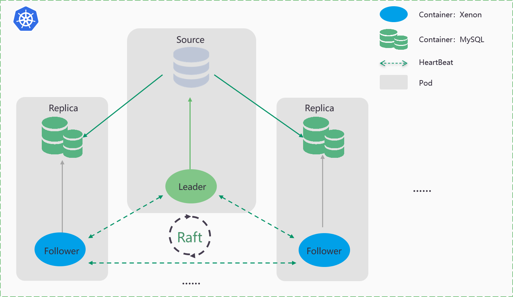

# RadonDB MySQL
   

English | [中文](README_zh.md) 

## What is RadonDB MySQL

[RadonDB MySQL](https://github.com/radondb/radondb-mysql-kubernetes) is a open-source, cloud-native, highly available cluster solutions that is based on [MySQL](https://MySQL.org) database. With the Raft protocol，RadonDB MySQL provide the faster failover performance without losing any transactions.

At present, RadonDB MySQL has supported the deployment of MySQL high availability clusters on kubernetes and kubesphere platforms.

## Architecture

- Achieving decentralized selection through the Raft protocol.
- Synchronize data based on GTID mode through Semi-Sync.

## Features

- High availability MySQL database
    - Non-centralized automatic leader selection
    - Second level switch leader to follower 
    - Strongly consistent data for cluster switching
- Cluster management
- Monitoring and alerting
- Logs
- Account management

## Installation

- [Deploy RadonDB MySQL on Kubernetes](docs/Kubernetes/deploy_radondb-mysql_on_kubernetes.md)
- [Deploy RadonDB MySQL on the appstore of KubeSphere](docs/KubeSphere/deploy_radondb-mysql_on_kubesphere.md)

## Release

| Release | Features  | Mode |
|------|--------|--------|
| 1.0 | High availability    Non-centralized automatic leader election    Second level switch    Strongly consistent data   Cluster management   Monitoring and alerting   Logs   Account management | Helm |
| 2.0 | Node management   Automatic expansion and shrinkage capacity   Upgrade   Backups and Restorations   Automatic failover   Automatic rebuild node   Automatic restart service（all or signal node）  Account management（API）  Migrating Data online | Operator |
| 3.0 | Automatic O&M   Multiple node roles   Disaster Recovery   SSL transmission encryption  | Operator |

## Who are using RadonDB MySQL

## License

RadonDB MySQL is released under the Apache 2.0, see [LICENSE](./LICENSE).
## Discussion and Community

- Forum

The RadonDB MySQL topic in [Kubesphere Community](https://kubesphere.com.cn/forum/t/radondb).

- WeChat group

To enter the wechat group of radondb community, please add administrator wechat.

Please submit any RadonDB MySQL bugs, issues, and feature requests to RadonDB MySQL GitHub Issue.
