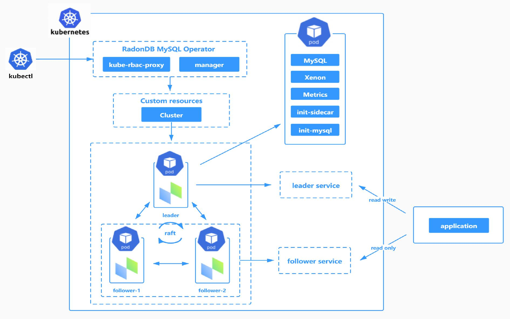

  

English | [中文](README_zh.md) 

# What is RadonDB MySQL

[RadonDB MySQL](https://github.com/radondb/radondb-mysql-kubernetes) is an open-source, cloud-native, highly availability cluster solutions based on [MySQL](https://MySQL.org). With the Raft protocol，RadonDB MySQL provides faster failover performance without losing any transactions.

## RadonDB MySQL Kubernetes

RadonDB MySQL Kubernetes supports deployment and management of RaodnDB MySQL clusters on [Kubernetes](https://kubernetes.io) or [KubeShpere](https://kubesphere.com.cn) and automates tasks related to operating a RadonDB MySQL cluster.

## Architecture

- Decentralized leader automatic election through Raft protocol.
- Synchronizing data based on GTID mode through Semi-Sync.
- Supporting high-availability through [Xenon](https://github.com/radondb/xenon.git).

## Features

- High availability MySQL database
    - Non-centralized automatic leader selection
    - Leader-follower switching in second-level
    - Strongly consistent data for cluster switching
- Cluster management
- [Monitoring and alerting](docs/deploy_monitoring.md)
- [Backups](docs/deploy_backup_restore_s3.md)
- Logs
- Account management

## Quick Start

### Helm

- [Deploy RadonDB MySQL on Kubernetes](docs/kubernetes/deploy_radondb-mysql_on_kubernetes.md)
- [Deploy RadonDB MySQL through git on Kubesphere](docs/kubesphere/deploy_radondb-mysql_on_kubesphere.md)
- [Deploy RadonDB MySQL through helm repo on Kubesphere](docs/kubesphere/deploy_radondb-mysql_on_kubesphere_repo.md)
- [Deploy RadonDB MySQL through Appstore of KubeSphere](docs/kubesphere/deploy_radondb-mysql_on_kubesphere_appstore.md)

### Operator

- [Deploy RadonDB MySQL on Kubernetes](docs/kubernetes/deploy_radondb-mysql_operator_on_k8s.md)

## Roadmap

| Release | Features  | Mode |
|------|--------|--------|
| 1.0 | Cluster management   Monitoring and alerting   Logs   Account management | Helm |
| 2.0 | Node management   Automatic expansion and shrinkage capacity   Upgrade   Backups and Restorations   Automatic failover   Automatic rebuild node   Automatic restart service（all or signal node）  Account management（API）  Migrating Data online | Operator |
| 3.0 | Automatic O&M   Multiple node roles   Disaster Recovery   SSL transmission encryption  | Operator |

## Who are using RadonDB MySQL

## License

RadonDB MySQL is released under the Apache 2.0, see [License](./LICENSE).

## Discussion and Community

- Forum

    The RadonDB MySQL topic is in [KubeSphere Community](https://kubesphere.com.cn/forum/t/radondb).

- Please pay attention to our official account.

  

---

  
Please submit any RadonDB MySQL bugs, issues, and feature requests to RadonDB MySQL GitHub Issue.
 
</a>

