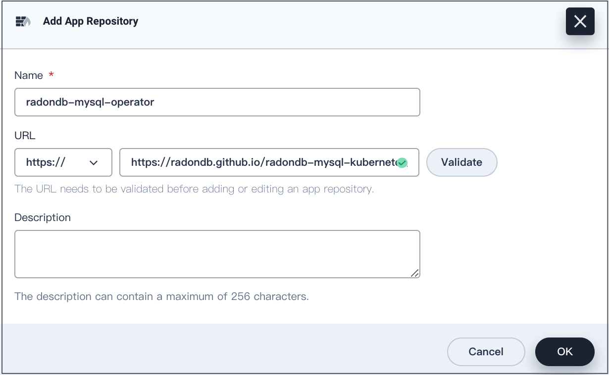
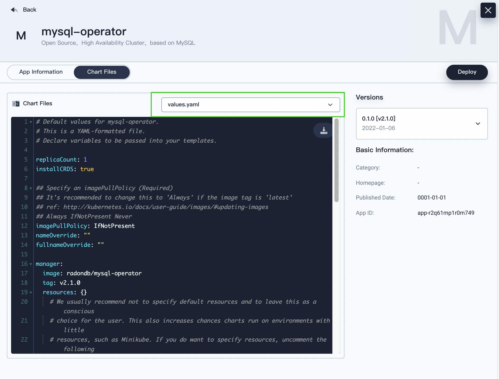
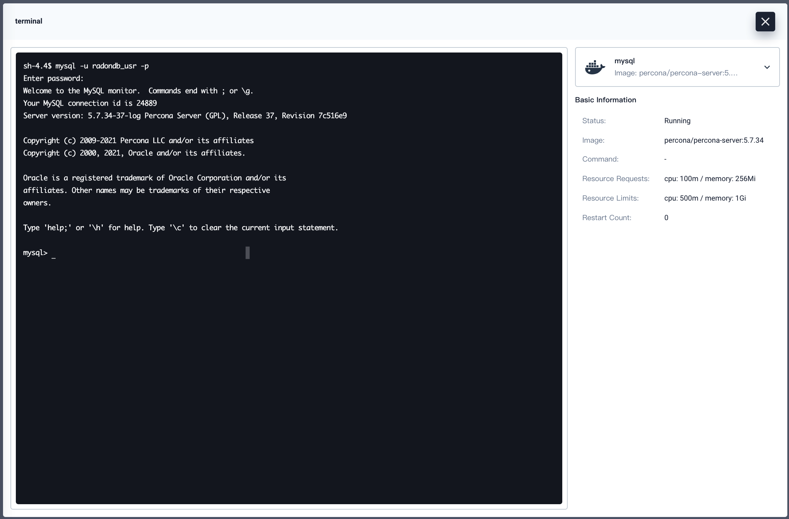
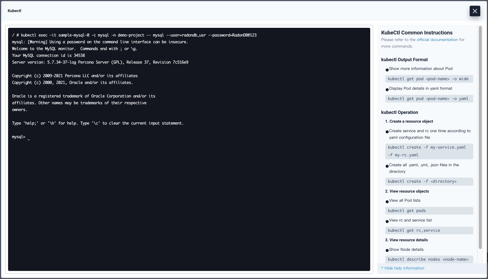

English | [简体中文](../zh-cn/deploy_radondb-mysql_operator_on_kubesphere.md) 

Contents
=============

   * [Deploy RadonDB MySQL Operator and RadonDB MySQL Cluster on KubeSphere](#deploy-radondb-mysql-operator-and-radondb-mysql-cluster-on-kubesphere)
      * [Prerequisites](#prerequisites)
      * [Procedure](#Procedure)
         * [Step 1: Add an app repository](#step-1-add-an-app-repository)
         * [Step 2: Deploy RadonDB MySQL Operator](#step-2-deploy-radondb-mysql-operator)
         * [Step 3: Deploy a RadonDB MySQL cluster](#step-3-deploy-a-radondb-mysql-cluster)
      * [Deployment verification](#deployment-verification)
      * [Access the RadonDB MySQL cluster](#access-the-radondb-mysql-cluster)
         * [Method 1: Pod terminal](#method-1-pod-terminal)
         * [Method 2: Kubectl](#method-2-kubectl)

# Deploy RadonDB MySQL Operator and RadonDB MySQL Cluster on KubeSphere

[RadonDB MySQL](https://github.com/radondb/radondb-mysql-kubernetes) is an open-source, cloud-native, and high-availability cluster solution based on [MySQL](https://MySQL.org). It enables fast failover without loss of transaction by adopting the Raft protocol.

This tutorial demonstrates how to deploy RadonDB MySQL Operator and a RadonDB MySQL cluster on KubeSphere.

## Prerequisites

- You need to enable the [KubeSphere App Store (OpenPitrix)](https://kubesphere.io/docs/pluggable-components/app-store/).
- You need to create a workspace, project, and user account. Log in to the Web console as `admin` and operate in the `demo-project` of the demo workspace. For more information, see [Create Workspaces, Projects, Users and Roles](https://kubesphere.io/docs/quick-start/create-workspace-and-project/).
- You need to enable a [gateway](https://kubesphere.io/docs/project-administration/project-gateway/) for external access.

## Procedure

### Step 1: Add an app repository.

1. Log in to the KubeSphere Web console.

2. In the `demo` workspace, go to **App Repositories** under **App Management**, and then click **Add**.

3. In the dialog that appears, specify an app repository name and URL.

   Specify `radondb-mysql-operator` as the repository name. Add `https://radondb.github.io/radondb-mysql-kubernetes/` as the repository URL. Click **Validate** to verify the URL.

4. A green check mark is displayed next to the URL if it is available. Click **OK** to continue.

   Your repository displays in the list after it is successfully imported to KubeSphere.



### Step 2: Deploy RadonDB MySQL Operator.

1. In `demo-project`, go to **Apps** under **Application Workloads** and click **Deploy New App**.

2. In the dialog that appears, select **From App Template**.

3. On the new page that appears, select `radondb-mysql-operator` from the drop-down list.

4. Click **mysql-operator**, and config RadonDB MySQL Operator.

   On the **Chart Files** tab, you can view the configuration and edit the `.yaml` files.  
   On the **Version** list, you can view the app versions and select a version.

   

5. Click **Deploy**, and go to the **Basic Information** page.  

   Confirm the app name, app version, and deployment location.

6. Click **Next** to continue, and go to the **App Configuration** page.

   You can customize settings by modifying the YAML file.

7. Click **Deploy**, and return to the **App Template** page.

   The application is successfully deployed when the application status changes to **running**.

### Step 3: Deploy a RadonDB MySQL cluster.

You can deploy a cluster by referring to the [RadonDB MySQL sample](/config/samples), or customizing the YAML file.

Take `mysql_v1alpha1_mysqlcluster.yaml` template as an example to create a RadonDB MySQL cluster.

1. Hover your cursor over the hammer icon in the lower-right corner, and then select **Kubectl**.

2. Run the following command to install the RadonDB MySQL cluster.

   ```kubectl
   kubectl apply -f https://github.com/radondb/radondb-mysql-kubernetes/releases/latest/download/mysql_v1alpha1_mysqlcluster.yaml --namespace=<project_name>
   ```
>**Note**
>
>   When no project is specified, the cluster will be installed in the `kubesphere-controls-system` project by default. To specify a project, you need to add the `--namespace=<project_name>` field in the install command.

   You can see the expected output as below if the installation is successful.

   ```powershell
   $ kubectl apply -f https://github.com/radondb/radondb-mysql-kubernetes/releases/latest/download/mysql_v1alpha1_mysqlcluster.yaml --namespace=demo-project
   mysqlcluster.mysql.radondb.com/sample created
   ```

3. You can run the following command to view all services of the RadonDB MySQL cluster.

   ```kubectl
   kubectl get statefulset,svc
   ```

   **Expected output**

   ```powershell
   $ kubectl get statefulset,svc
   NAME                            READY   AGE
   statefulset.apps/sample-mysql   3/3     10m

   NAME                           TYPE        CLUSTER-IP      EXTERNAL-IP   PORT(S)    AGE
   service/default-http-backend   ClusterIP   10.96.69.202    <none>        80/TCP     3h2m
   service/sample-follower        ClusterIP   10.96.9.162     <none>        3306/TCP   10m
   service/sample-leader          ClusterIP   10.96.255.188   <none>        3306/TCP   10m
   service/sample-mysql           ClusterIP   None            <none>        3306/TCP   10m
   ```

## Deployment verification

1. In `demo-project` project, go to **Services** under **Application Workloads** for the information of services.

2. Go to the **Workloads** page under **Application Workloads**, and click the **StatefulSets** tab for the cluster status.

   Click a StatefulSet to go to its detail page and click the **Monitoring** tab to see the metrics in the line charts over a period.

3. Go to the **Pods** page under **Application Workloads** for the node status.

4. Go to the **Volumes** page under **Storage** to check volume usage. Clicking a data node to view the monitoring information, including the current storage capacity and remaining storage.

## Access the RadonDB MySQL cluster

This section demonstrates how to access RadonDB MySQL in KubeSphere Web console.

### Method 1: Pod terminal

Go to the `demo-project` management page, and access RadonDB MySQL by the terminal.

1. Go to **Pods** under **Application Workloads**.

2. Click a pod name to go to the pod management page.

3. Under the **Container** column box in **Resource Status**, click the terminal icon for the **mysql** container.

4. In terminal window, run the following command to access the RadonDB MySQL cluster.



### Method 2: Kubectl

Hover your cursor over the hammer icon in the lower-right corner, and then select **Kubectl**.

Run the following command to access the RadonDB MySQL cluster.

```kubectl
kubectl exec -it <pod_name> -c mysql -n <project_name> -- mysql --user=<user_name> --password=<user_password>
```

>Note
>
>In the following command, pod name: `sample-mysql-0`, project name: `demo-project`, username: `radondb_usr`, user password: `RadonDB@123`
Please use your own pod name, project name, username, and password.


