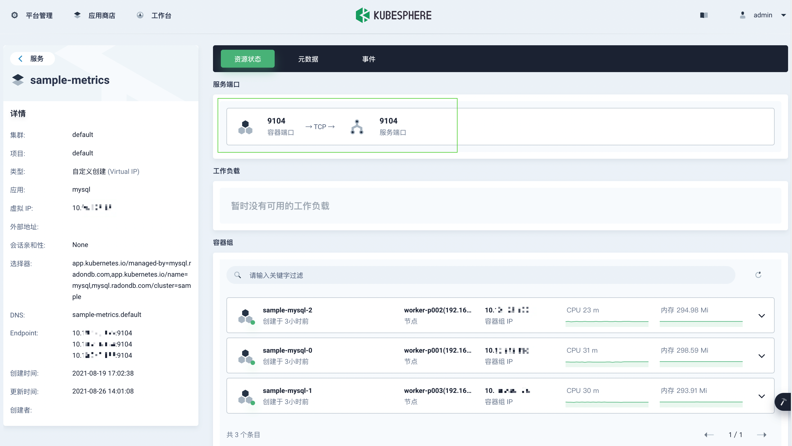
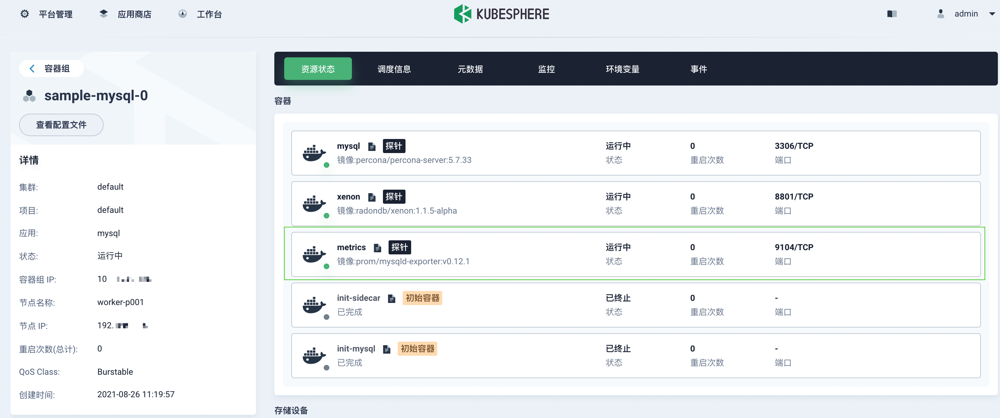
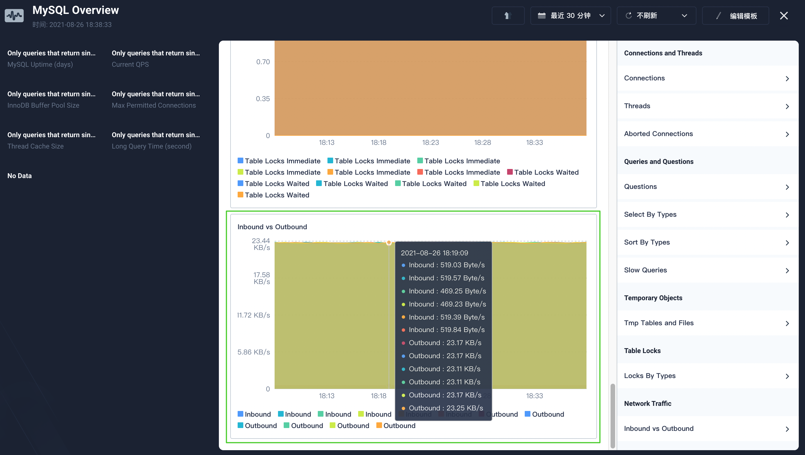
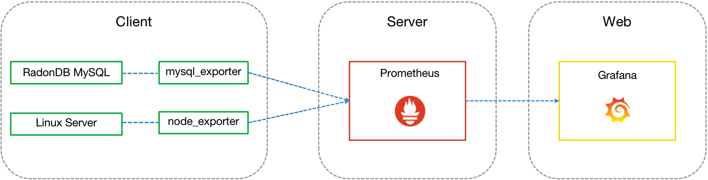

[English](../en-us/deploy_monitoring.md) | 简体中文

目录
=================

   * [开启监控指标](#开启监控指标)
      * [简介](#简介)
      * [准备工作](#准备工作)
      * [部署步骤](#部署步骤)
         * [步骤 1：配置 serviceMonitor](#步骤-1-配置-servicemonitor)
         * [步骤 2: 配置 metricsOpts](#步骤-2-配置-metricsopts)
      * [查看监控服务](#查看监控服务)
         * [通过客户端查看](#通过客户端查看)
         * [在 KubeSphere 平台查看](#在-kubesphere-平台查看)
      * [查看监控](#查看监控)
         * [通过 KubeSphere 自定义监控](#通过-kubesphere-自定义监控)
         * [通过 Prometheus + Grafana 平台](#通过-prometheus--grafana-平台)

# 开启监控指标

## 简介

[Prometheus](https://prometheus.io/) 基于文本的暴露格式，已经成为云原生监控领域事实上的标准格式。

RadonDB MySQL 监控引擎基于 [Prometheus MySQLd Exporter](https://github.com/prometheus/mysqld_exporter) 定义。通过 `mysqld-exporter` 抓取 RadonDB MySQL 服务指标，再通过接入第三方应用平台实现监控指标可视化。

本教程演示如何开启 RadonDB MySQL 监控指标。

## 准备工作

- 已准备可用 Kubernetes 或 KubeSphere 集群。
- 已获取RadonDB MySQL Operator 2.1.0 及以上版本。

## 部署步骤

### 步骤 1：配置 serviceMonitor

`serviceMonitor` 是定义 RadonDB MySQL Operator 自动监控引擎的参数，开启后将自动绑定 `mysqld_exporter` 与 Prometheus。

`serviceMonitor` 参数包含如下字段：

```bash
serviceMonitor:
  enabled: true
  ## Additional labels for the serviceMonitor. Useful if you have multiple prometheus operators running to select only specific ServiceMonitors
  # additionalLabels:
  #   prometheus: prom-internal
  interval: 10s
  scrapeTimeout: 3s
  # jobLabel:
  # targetLabels:
  # podTargetLabels:
  namespaceSelector:
    any: true
  selector:
    matchLabels:
      app.kubernetes.io/managed-by: mysql.radondb.com
      app.kubernetes.io/name: mysql
```

您可以在 `charts/mysql-operator/values.yaml` 文件中配置 `serviceMonitor`。

- 新部署 Operator 时， `serviceMonitor.enabled` 默认为 **true**，表示默认开启。
- 已部署 Operator 2.1.0 以下版本的集群，需重新部署 Operator。

### 步骤 2：配置 metricsOpts

`metricsOpts` 是 CRD `mysqlclusters.mysql.radondb.com` 中定义 RadonDB MySQL 集群监控的参数，可通过配置`mysql_v1alpha1_mysqlcluster.yaml` 文件中参数值开启监控服务。

`metricsOpts` 参数包含如下字段：

```bash
metricsOpts:
    enabled: false  
    image: prom/mysqld-exporter:v0.12.1

    resources:
      requests:
        cpu: 10m
        memory: 32Mi
      limits:
        cpu: 100m
        memory: 128Mi
```

`metricsOpts.enabled` 默认为 **false**，需手动设置为 **true**。

- 选择设置 `metricsOpts.enabled` 状态为 **true**，开启集群监控功能。
- 设置资源参数值，定义监控容器资源配额大小。

文件参数修改完成后，使用如下指令应用配置，部署/更新集群回显信息如下：

```bash
$ kubectl apply -f config/sample/mysql_v1alpha1_mysqlcluster.yaml
cluster.mysql.radondb.com/sample created/configured
```

## 查看监控服务

### 通过客户端查看

您可以通过如下指令查看集群监控服务和 serviceMonitor 信息。

```bash
$ kubectl get service,servicemonitor

$ kubectl describe servicemonitor <serviceName>
```

**预期效果**

```shell
$ kubectl get service,servicemonitor
NAME                             TYPE        CLUSTER-IP      EXTERNAL-IP   PORT(S)    AGE
service/mysql-operator-metrics   ClusterIP   10.96.242.205   <none>        8443/TCP   3h25m
service/sample-follower          ClusterIP   10.96.2.234     <none>        3306/TCP   21h
service/sample-leader            ClusterIP   10.96.30.238    <none>        3306/TCP   21h
service/sample-metrics           ClusterIP   10.96.7.222     <none>        9104/TCP   3h24m
service/sample-mysql             ClusterIP   None            <none>        3306/TCP   21h

NAME                                                              AGE
servicemonitor.monitoring.coreos.com/demo-mysql-operator          3h25m

$ kubectl describe servicemonitor demo-mysql-operator 
Name:         test-radondb-mysql-metrics
Namespace:    default
Labels:       app=test-radondb-mysql
              app.kubernetes.io/managed-by=Helm
              app.kubernetes.io/vendor=kubesphere
              chart=radondb-mysql-1.0.0
              heritage=Helm
              release=test
Annotations:  kubesphere.io/creator: admin
API Version:  monitoring.coreos.com/v1
Kind:         ServiceMonitor
......
Spec:
  Endpoints:
    Interval:        1m
    Path:            /metrics
    Port:            metrics
    Scheme:          http
    Scrape Timeout:  10s
......
```

### 在 KubeSphere 平台查看

在 KubeSphere 企业空间部署的 RadonDB MySQL Operator 和集群，开启监控后，可在如下页面查看监控服务状态。

- 在项目空间**应用负载**下的**服务**页面，点击 `<集群名称>-metrics `，可查看监控服务信息。

   

- 在项目空间**应用负载**下的**容器组**页面，点击一个容器的名称，可查看该容器中 `metrics` 资源状态。

   

## 查看监控

### 通过 KubeSphere 自定义监控

> **说明**
> 
> RadonDB MySQL Operator 和集群需部署在 KubeSphere。

KubeSphere 的监控引擎基于 Prometheus 和 Prometheus Operator。使用 KubeSphere 的自定义监控功能支持以可视化的形式监控 RadonDB MySQL 指标。

1. 在集群同一项目中，选择**监控告警**下的**自定义监控**，点击**创建**。
2. 在对话框中，选择 **MySQL** 模版，并继续配置监控模版。

   

3. 点击**保存模版**，即新创建监控面板。

   

4. 新建监控面板需等待约十分钟，即可查看监控数据。

   

更多详情，请查看 KubeSphere [自定义监控介绍](https://kubesphere.io/zh/docs/project-user-guide/custom-application-monitoring/introduction/)和[可视化监控](https://kubesphere.io/zh/docs/project-user-guide/custom-application-monitoring/visualization/overview/)。

### 通过 Prometheus + Grafana 平台

[Grafana](https://github.com/grafana/grafana) 是一个跨平台、开源的数据可视化网络应用程序平台。通过 Prometheus + Grafana 平台查看监控基本原理如下：

- 通过 [mysql_exporter](https://github.com/prometheus/mysqld_exporter) 获取 RadonDB MySQL 服务监控数据。
- 通过 [node_exporter](https://github.com/prometheus/node_exporter) 获得 RadonDB MySQL 服务器的监控数据。
- 将监控数据传到 [Prometheus](https://prometheus.io/download/) 后，通过配置数据源，最终在 Grafana 呈现丰富的监控数据图表和警告。



更多 Grafana 可视化监控使用说明，请参见 [Grafana Dashboards](https://grafana.com/docs/grafana/latest/dashboards/)。
