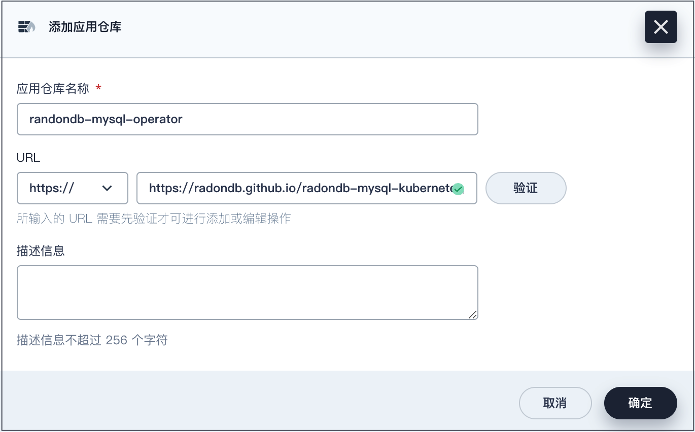
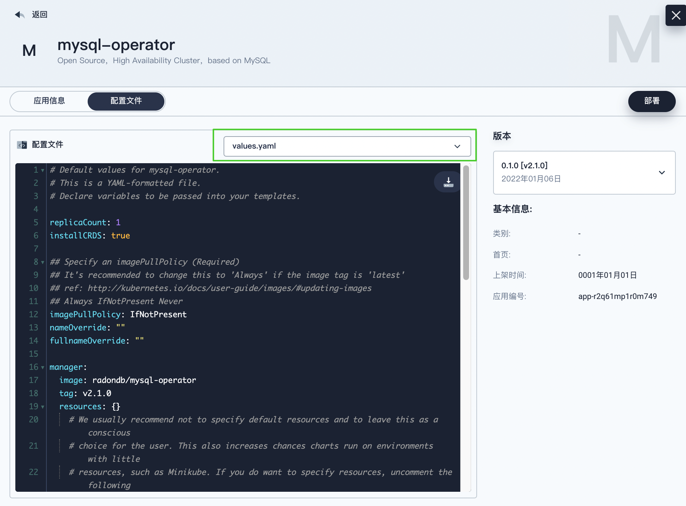
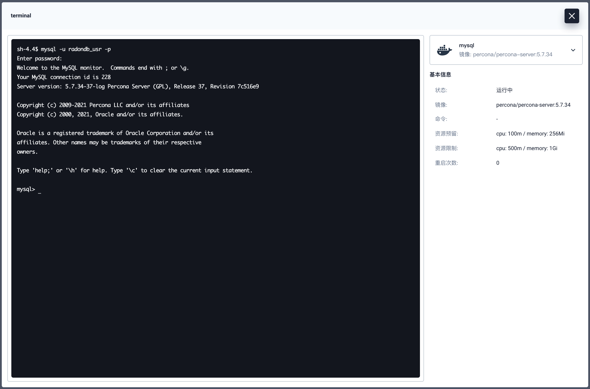
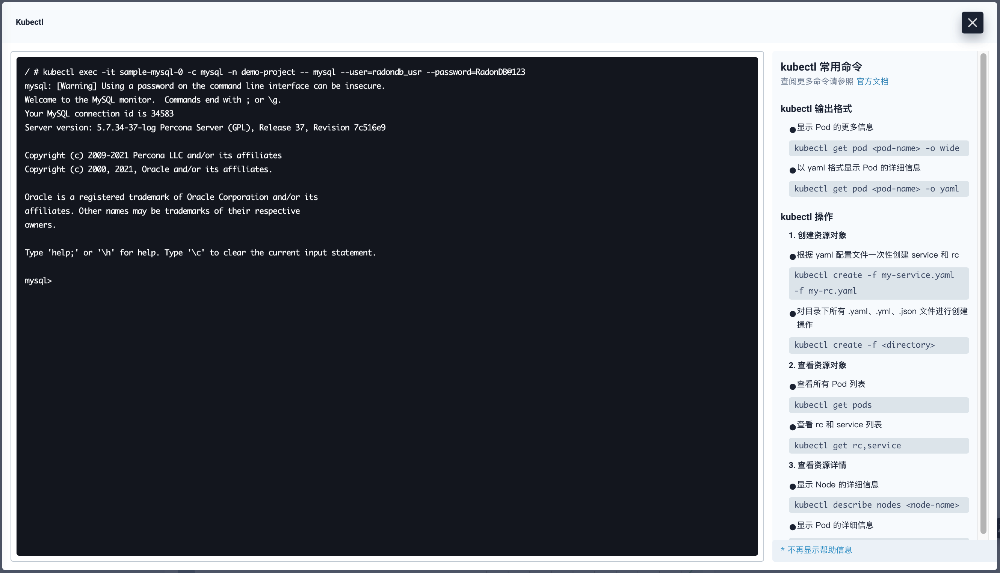

[English](../en-us/deploy_radondb-mysql_operator_on_kubesphere.md) | 简体中文 

Contents
=============

   * [在 KubeSphere 中部署 RadonDB MySQL Operator 和 RadonDB MySQL 集群](#在-kubesphere-中部署-radondb-mysql-operator-和-radondb-mysql-集群)
      * [部署准备](#部署准备)
      * [动手实验](#动手实验)
         * [步骤 1：添加应用仓库仓库](#步骤-1添加应用仓库)
         * [步骤 2：部署 RadonDB MySQL Operator](#步骤-2部署-radondb-mysql-operator)
         * [步骤 3：部署 RadonDB MySQL 集群](#步骤-3部署-radondb-mysql-集群)
      * [部署校验](#部署校验)
      * [访问 RadonDB MySQL](#访问-radondb-mysql)
         * [方式 1：通过终端访问](#方式-1通过终端访问)
         * [方式 2：通过 Kubectl 访问](#方式-2通过-kubectl-访问)

# 在 KubeSphere 中部署 RadonDB MySQL Operator 和 RadonDB MySQL 集群

[RadonDB MySQL](https://github.com/radondb/radondb-mysql-kubernetes) 是基于 [MySQL](https://MySQL.org) 的开源、云原生、高可用集群解决方案。通过使用 Raft 协议，RadonDB MySQL 可以快速进行故障转移，且不会丢失任何事务。

本教程演示了如何在 KubeSphere 上部署 RadonDB MySQL Operator 和 RadonDB MySQL 集群。

## 部署准备

- 请确保 [已启用 OpenPitrix 系统](https://kubesphere.io/zh/docs/pluggable-components/app-store/)。
- 您需要创建一个企业空间、一个项目和一个用户帐户供本教程操作使用。本教程中，请以 `admin` 身份登录控制台，在企业空间 `demo` 中的 `demo-project` 项目中进行操作。有关更多信息，请参见 [创建企业空间、项目、用户和角色](https://kubesphere.io/zh/docs/quick-start/create-workspace-and-project/)。
- 请确保 KubeSphere 项目网关已开启外网访问。有关更多信息，请参见 [项目网关](https://kubesphere.io/zh/docs/project-administration/project-gateway/)。

## 动手实验

### 步骤 1：添加应用仓库

1. 登录 KubeSphere 的 Web 控制台。

2. 在 `demo` 企业空间中，进入**应用管理**下的**应用仓库**页面，点击**添加**，弹出仓库配置对话框。

3. 输入仓库名称和仓库 URL。

   输入 `radondb-mysql-operator` 作为应用仓库名称。  
   输入 `https://radondb.github.io/radondb-mysql-kubernetes/` 作为仓库的 URL，并点击**验证**以验证 URL。

4. 在 URL 旁边呈现一个绿色的对号，验证通过后，点击**确定**继续。

   将仓库成功导入到 KubeSphere 之后，在列表中即可查看 RadonDB MySQL 仓库。



### 步骤 2：部署 RadonDB MySQL Operator

1. 在 `demo-project` 项目中，进入**应用负载**下的**应用**页面，点击**部署新应用**。

2. 在对话框中，选择**来自应用模板**，进入应用模版页面。

3. 从下拉菜单中选择 `radondb-mysql-operator` 应用仓库。

4. 点击 `mysql-operator` 应用，查看和配置 RadonDB MySQL Operator 应用信息。  

   在**配置文件**选项卡，可查看和编辑 `.yaml` 配置文件。  
   在**版本**列框区域，可查看和选择版本号。

   

5. 点击**部署**，进入 `mysql-operator` 应用基本信息配置页面。  

   确认应用名称、应用版本，以及配置部署位置。

6. 点击**下一步**，进入 `mysql-operator` 应用配置页面。  

   确认 `values.yaml` 配置信息，并可编辑文件修改配置。

7. 点击**部署**，返回**应用模版**页面。

   待应用状态切换为`运行中`，则应用部署成功。

### 步骤 3：部署 RadonDB MySQL 集群

您可以任选一个 [RadonDB MySQL 配置示例](/config/samples) 部署，或自定义配置部署。

以 `mysql_v1alpha1_mysqlcluster.yaml` 模版为例，创建一个 RadonDB MySQL 集群。

1. 在右下角**工具箱**中选择 **Kubectl** 工具，打开终端窗口。

2. 执行以下命令，安装 RadonDB MySQL 集群。

   ```bash
   kubectl apply -f https://github.com/radondb/radondb-mysql-kubernetes/releases/latest/download/mysql_v1alpha1_mysqlcluster.yaml --namespace=<project_name>
   ```

   > **注意**
   >
   > 未指定项目时，集群将被默认安装在 `kubesphere-controls-system` 项目中。若需指定项目，安装命令需添加 `--namespace=<project_name>`。

   **预期结果**

   ```powershell
   $ kubectl apply -f https://github.com/radondb/radondb-mysql-kubernetes/releases/latest/download/mysql_v1alpha1_mysqlcluster.yaml --namespace=demo-project
   mysqlcluster.mysql.radondb.com/sample created
   ```

3. 集群创建成果后，执行如下命令，可查看 RadonDB MySQL 集群节点服务。

   ```bash
   kubectl get statefulset,svc
   ```

   **预期结果**

   ```powershell
   $ kubectl get statefulset,svc
   NAME                            READY   AGE
   statefulset.apps/sample-mysql   3/3     10m

   NAME                           TYPE        CLUSTER-IP      EXTERNAL-IP   PORT(S)    AGE
   service/default-http-backend   ClusterIP   10.96.69.202    <none>        80/TCP     3h2m
   service/sample-follower        ClusterIP   10.96.9.162     <none>        3306/TCP   10m
   service/sample-leader          ClusterIP   10.96.255.188   <none>        3306/TCP   10m
   service/sample-mysql           ClusterIP   None            <none>        3306/TCP   10m
   ```

## 部署校验

在 `demo-project` 项目中，查看 RadonDB MySQL 集群状态。

1. 进入**应用负载**下的**服务**页面，可查看集群服务状态。

2. 进入**应用负载**下的**工作负载**页面，点击**有状态副本集**，可查看集群状态。

   进入一个有状态副本集群详情页面，点击**监控**标签页，可查看一定时间范围内的集群指标。

3. 进入**应用负载**下的**容器组**页面，可查看集群节点运行状态。

4. 进入**存储**下的**存储卷**页面，可查看存储卷，所有组件均使用了持久化存储。

   查看某个存储卷用量信息，以其中一个数据节点为例，可以看到当前存储的存储容量和剩余容量等监控数据。

## 访问 RadonDB MySQL

以下步骤演示在 KubeSphere 访问 RadonDB MySQL 的方式。

### 方式 1：通过终端访问

进入 `demo-project` 项目管理页面，通过容器组终端访问 RadonDB MySQL。

1. 进入**应用负载**下的**容器组**页面。

2. 在**容器组**下，点击集群其中一个容器组名称，进入容器组详情页面。

3. 在**资源状态**中**容器**列框下，点击 **mysql** 容器的**终端**图标。

4. 在终端窗口中，输入命令连接集群。



### 方式 2：通过 Kubectl 访问

在右下角**工具箱**中选择 **Kubectl** 工具，通过 Kubectl 工具访问 RadonDB MySQL。

执行如下命令连接集群，连接成功后即可使用 RadonDB MySQL 应用。

```kubectl
kubectl exec -it <pod_name> -c mysql -n <project_name> -- mysql --user=<user_name> --password=<user_password>
```

以下示例中相应参数取值如下：

- **pod_name** 为 `sample-mysql-0`
- **project_name** 为 `demo-project`  
- **user_name** 为 `radondb_usr`  
- **user_password** 为  `RadonDB@123`


