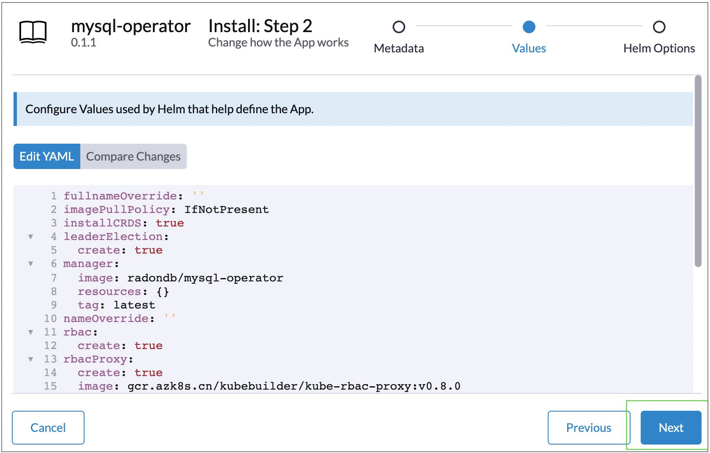
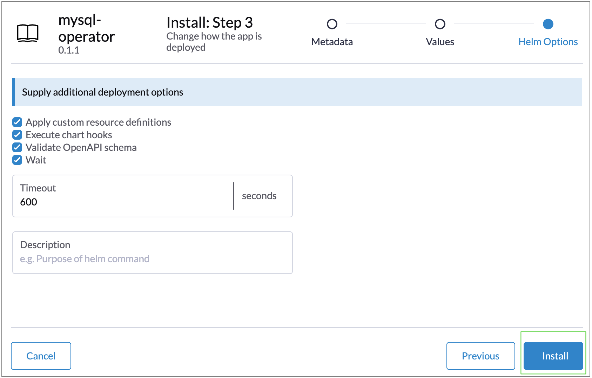
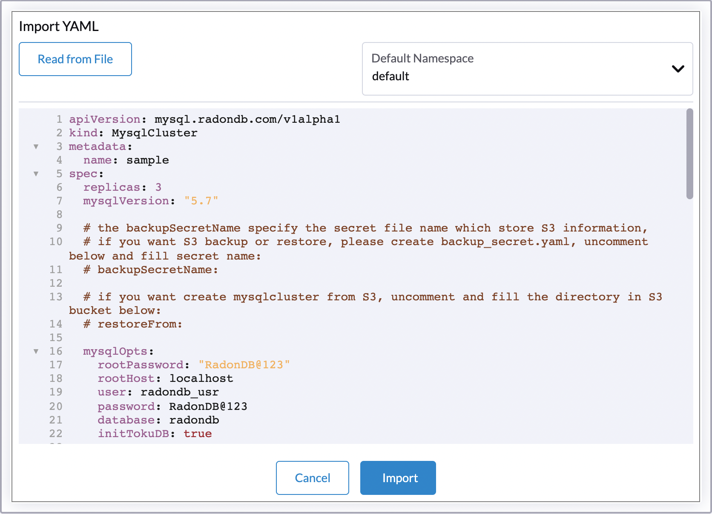

目录
=============

   * [在 Rancher 上部署 RadonDB MySQL 集群（Operator）](#在-rancher-上部署-radondb-mysql-集群（Operator）)
      * [简介](#简介)
      * [部署准备](#部署准备)
      * [部署步骤](#部署步骤)
         * [步骤 1：添加 Helm 仓库](#步骤-1-添加-helm-仓库)
         * [步骤 2：部署 Operator](#步骤-2-部署-operator)
         * [步骤 3：部署 RadonDB MySQL 集群](#步骤-3-部署-radondb-mysql-集群)
         * [部署验证](#部署验证)
      * [访问 RadonDB MySQL](#访问-radondb-mysql)

# 在 Rancher 上部署 RadonDB MySQL 集群（Operator）

## 简介

RadonDB MySQL 是一款基于 MySQL 的开源、高可用、云原生集群解决方案。支持一主多从高可用架构，并具备安全、自动备份、监控告警、自动扩容等全套管理功能。目前已经在生产环境中大规模的使用，包含**银行、保险、传统大企业**等。

RadonDB MySQL 支持在 Rancher 上安装部署和管理，自动执行与运行 RadonDB MySQL 集群有关的任务。

本教程主要演示如何在 Rancher 上部署 RadonDB MySQL Operator 和 RadonDB MySQL 集群。

## 部署准备

- 已[部署 Rancher 集群](https://rancher.com/docs/rancher/v2.6/en/quick-start-guide/deployment/quickstart-manual-setup/)，并已获取 Rancher 管理控制台登录账号和密码。

## 部署步骤

### 步骤 1: 添加 Helm 仓库

1. 登录 Rancher 管理控制台。
2. 点击目标集群，进入集群管理页面。
3. 选择 **App&Marketplace** > **Repositories**，进入应用仓库管理页面。
4. 点击 **Create**，配置 RadonDB MySQL 仓库。

   -**Name**：自定义仓库名称。

   -**Target**：可选择 http(s) 方式，配置 **Index URL** 为 `https://radondb.github.io/radondb-mysql-kubernetes/`。

5. 点击 **Create**，返回仓库管理页面。

   当仓库 **State** 切换为 `Active`，则添加仓库正常运行。

### 步骤 2: 部署 Operator

一个 Rancher 集群仅需部署一次 RadonDB MySQL Operator。

1. 在集群管理页面，选择 **App&Marketplace** > **Charts**，进入 Charts 列表页面。
2. 找到 **mysql-operator**，部署 Operator 页面。
   
   可选择 mysql-operator Charts 版本。

   

3. 点击 **Install**，配置应用基本信息。
   
   可勾选自定义 Helm 选项。

   

4. （可选）点击 **Next**，自定义编辑应用 YAML。

   

5. 点击 **Next**，配置部署属性。

   

6. 点击 **Install**，跳转到 **Installed App** 管理页面。

   可在列表下方窗口，查看安装进度和状态。当应用部署完成后，可在列表查看到已安装的应用。

### 步骤 3: 部署 RadonDB MySQL 集群

#### 通过命令方式

1. 在集群管理页面，点击右上角 Kubectl 命令图标。

   

2. 在命令窗口，输入创建集群命令。

   如下示例为部署一个三节点的样例集群。

   ```shell
   # Run kubectl commands inside here
   # e.g. kubectl get all
   $ cat <<EOF | kubectl apply -f-
   apiVersion: mysql.radondb.com/v1alpha1
   kind: MysqlCluster
   metadata:
      name: sample
   spec:
      replicas: 3
   EOF
   ```

3. 回车执行命令，回显提示 `created` 则部署成功。

   预期回显信息示例：

   ```shell
   mysqlcluster.mysql.radondb.com/sample created
   ```

#### 通过导入 YAML 方式

1. 下载 [RadonDB MySQL 集群配置样例](/config/samples/mysql_v1alpha1_mysqlcluster.yaml)，修改 YAML 文件中配置参数值。

   详细配置参数说明，请参见[配置参数](./config_para.md)。

2. 在 Rancher 集群管理页面，点击右上角 YAML 导入图标。在弹出的窗口中，导入修改后的 YAML 文件。

   

### 部署验证

1. 在集群管理页面，选择 **Service Discovery** > **Service**，进入服务列表页面。
2. 找到部署的集群，查看服务状态。
   
   状态为 `Active`，表示服务正常运行。

3. 点击服务名称，进入服务详情页面，查看 Pod 状态。

   状态为 `Active`，表示 Pod 正常运行。

4. 在正在运行的 Pod 行，点击 Execute Shell，展开 Pod 命令窗口。
   
   执行如下命令并输入密码，验证数据库连接状态。

   ```shell
   $ mysql -u root -p
   ```

   正常连接数据库回显信息如下图：

   

## 访问 RadonDB MySQL

> **注意**
> 
> 准备可用于连接 MySQL 的客户端。

- 当客户端与数据库部署在不同 Rancher 集群，请[在 Rancher 中设置 Load Balancer 和 Ingress Controller](https://rancher.com/docs/rancher/v2.6/en/k8s-in-rancher/load-balancers-and-ingress/)。
  
  更多访问不同集群中数据库方式说明，请参见 [Kubernetes 访问集群中的应用程序](https://kubernetes.io/zh/docs/tasks/access-application-cluster/)。

- 当客户端与数据库部署在同一 Rancher 集群内，可选择使用 `service_name` 或者 `clusterIP` 方式，访问 RadonDB MySQL。
  
   > **说明**
   > 
   > RadonDB MySQL 提供 leader 服务和 follower 服务用于分别访问主从节点。leader 服务始终指向主节点（读写），follower 服务始终指向从节点（只读）。

以下为客户端与数据库在同一 Rancher 集群内，访问 RadonDB MySQL 的方式。

### `clusterIP` 方式

RadonDB MySQL 的高可用读写 IP 指向 leader 服务的 `clusterIP`，高可用只读 IP 指向 follower 服务的 `clusterIP`。

```shell
$ mysql -h <clusterIP> -P <mysql_Port> -u <user_name> -p
```

以下示例用户名为 `radondb_usr`， leader 服务的 clusterIP 为 `10.10.128.136` ，连接示例如下：

```shell
$ mysql -h 10.10.128.136 -P 3306 -u radondb_usr -p
```

### `service_name` 方式

Rancher 集群的 Pod 之间支持通过 `service_name` 方式访问 RadonDB MySQL。

> **说明**
> 
> `service_name` 方式不适用于从 Rancher 集群的物理机访问数据库 Pod。

* 连接 leader 服务(RadonDB MySQL 主节点)

    ```shell
    mysql -h <leader_service_name>.<namespace> -u <user_name> -p
    ```

   用户名为 `radondb_usr`，release 名为 `sample`，RadonDB MySQL 命名空间为 `default`，连接示例如下：

    ```shell
    mysql -h sample-leader.default -u radondb_usr -p
    ```

* 连接 follower 服务(RadonDB MySQL 从节点)

    ```shell
    mysql -h <follower_service_name>.<namespace> -u <user_name> -p
    ```

   用户名为 `radondb_usr`，release 名为 `sample`，RadonDB MySQL 命名空间为 `default` ，连接示例如下：

    ```shell
    mysql -h sample-follower.default -u radondb_usr -p  
    ```