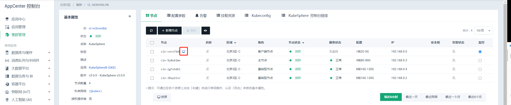
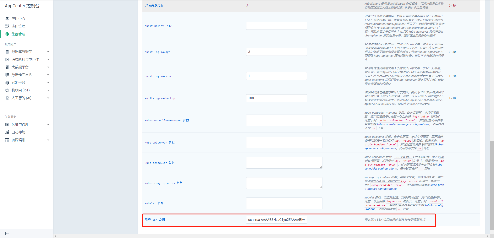
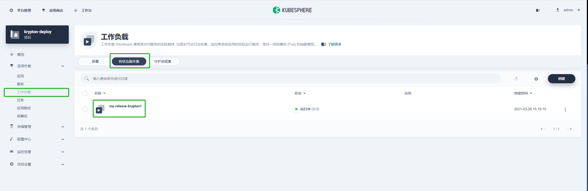
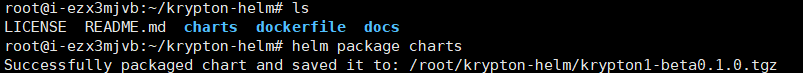
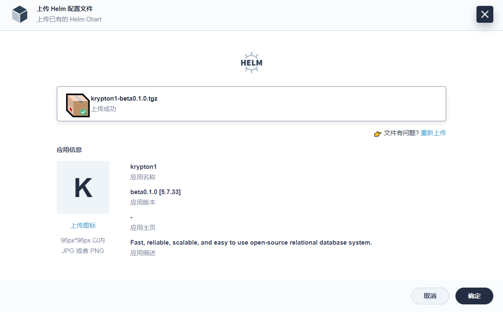
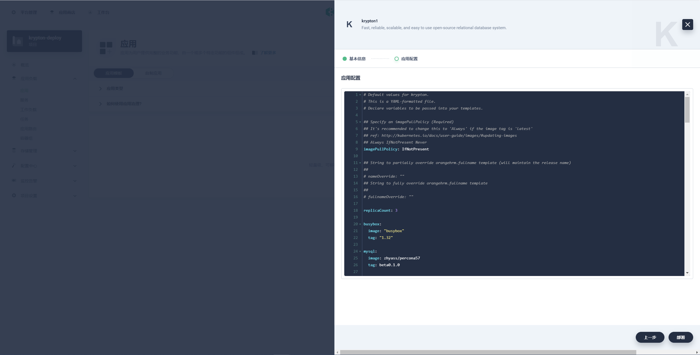
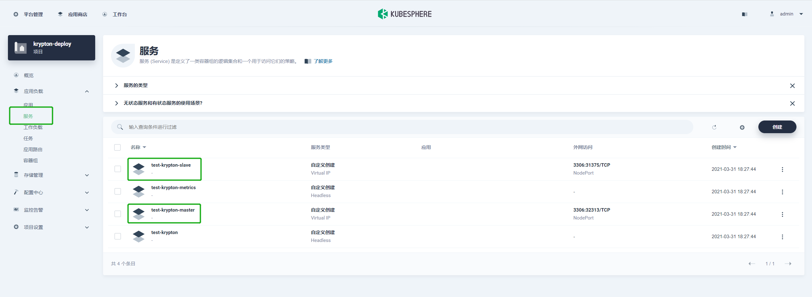
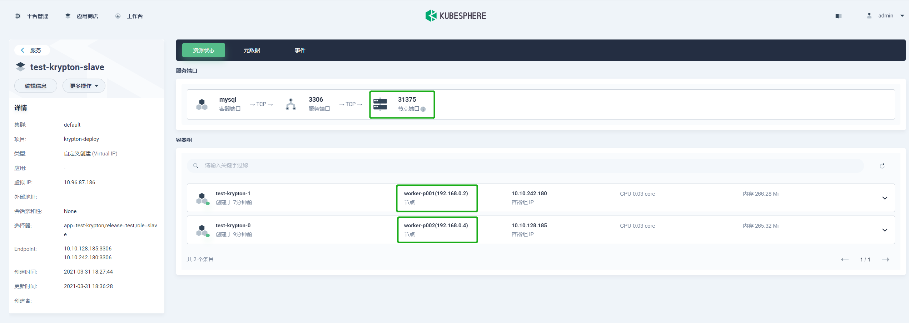

# **在 Kubesphere 上部署 Krypton 集群**

## **简介**

[KubeSphere](https://kubesphere.io) 是在 Kubernetes 之上构建的开源容器混合云，提供全栈的 IT 自动化运维的能力，简化企业的 DevOps 工作流。KubeSphere 提供了运维友好的向导式操作界面，帮助企业快速构建一个强大和功能丰富的容器云平台。

Krypton 是基于 MySQL 的开源、高可用、云原生集群解决方案。通过使用 Raft 协议，Krypton 可以快速进行故障转移，且不会丢失任何事务。

## **部署准备**

### **安装 KubeSphere**

可选择如下安装方式：

- 在 [青云QingCloud AppCenter](https://appcenter.qingcloud.com/apps/app-cmgbd5k2) 上安装 Kubersphere。
- [在 Kubernetes 上安装 Kubersphere](https://kubesphere.io/zh/docs/installing-on-kubernetes/)。
- [在 Linux 上安装 Kubersphere](https://kubesphere.io/zh/docs/installing-on-linux/)。

### **创建 KubeSphere 多租户系统**

参考 KubeSphere 官方文档：[创建企业空间、项目、帐户和角色](https://kubesphere.io/zh/docs/quick-start/create-workspace-and-project/)。

### **连接 KubeSphere 客户端节点**

> 说明：如下示例适用于 KubeSphere 安装在 [青云QingCloud AppCenter](https://appcenter.qingcloud.com/apps/app-cmgbd5k2) 的场景。

通过[青云QingCloud控制台](https://console.qingcloud.com/) 直接连接客户端节点。



通过第三方 SSH 工具连接客户端节点，请先在 KubeSphere 配置参数中配置公钥。



## **部署步骤**

可选择 [命令行](#通过命令行部署 krypton 集群) 和使用 [控制台](#通过控制台部署 krypton 集群) 两种部署方式部署 Krypton 集群。

### **通过命令行部署 Krypton集群**

#### **步骤 1：拉取 Krypton Chart**

将 Krypton Chart 拉取到 KubeSphere 客户端节点中。

```bash
git clone https://github.com/zhyass/krypton-helm.git
```

> Chart 代表 [Helm](https://helm.sh/zh/docs/intro/using_helm/) 包，包含在 Kubernetes 集群内部运行应用程序、工具或服务所需的所有资源定义。

#### **步骤 2：部署**

* **默认部署**

  需指定 release 名称，以下为指定 release 名为 `my-release` 的默认部署指令。
  
  > 说明：release 是运行在 Kubernetes 集群中的 Chart 的实例。

  ```bash
  ## For Helm v2
    cd charts
    helm install . my-release

  ## For Helm v3
    cd charts
    helm install my-release .
  ```

* **指定参数部署**

  在 `helm install` 时使用 `--set key=value[,key=value]` 指令。以下指令创建了一个用户名为 `my-user` ，密码为 `my-password` 的标准数据库用户，可访问名为 `my-database` 的数据库。

  ```bash
  cd charts
  helm install my-release \
  --set mysql.mysqlUser=my-user,mysql.mysqlPassword=my-password,mysql.database=my-database .
  ```

  通过 value.yaml 文件，在安装时配置指定参数，如下指令。更多安装过程中可配置的参数，请参考 [配置](#配置) 。

  ```bash
  cd charts
  helm install my-release -f values.yaml .
  ```

#### **步骤 3：部署校验**

默认部署指令执行完成后，回显如下提示信息，则部署指令执行成功。


登录 KubeSphere 的 Web 控制台，在**工作负载**中选择**有状态副本集**页签，可查看到目标副本集，则Krypton 已经成功部署。



### **通过控制台部署 Krypton 集群**

#### **步骤 1：创建 Krypton Chart 压缩包**

拉取 Krypton Chart。

```bash
git clone https://github.com/zhyass/krypton-helm.git
```

打包生成 tgz 或 tar.gz 文件。

```bash
cd krypton-helm
helm package charts
```



#### **步骤 2：部署**

（1）登录 KubeSphere 的 Web 控制台。

（2）选择 **平台管理 > 访问控制** ，进入平台级的访问控制页面。

（3）选择**企业空间**，并点击已创建的 `krypton-workspace` 企业空间名称，进入企业空间管理页面。


（4）上传压缩包。

  选择 **应用管理 > 应用模板**，进入应用模板配置页面。


  点击 **创建** ，在弹窗中上传步骤一创建的 Krypton Chart 压缩包。



（5）部署新应用。

  点击 **项目管理**，进入已创建的 `krypton-deploy` 项目管理中心。

  
  
  选择 **应用负载 > 应用**，进入项目应用管理页面。


  点击 **部署新应用**，在 **来自应用模板**窗口中选择 `krypton1`。


  编辑应用模板基本信息。
  


  编辑应用配置，点击**部署** 即可完成部署。



  >说明：示例使用默认参数部署。

#### **步骤 3：部署校验**

在**项目管理**管理中心，选择 **应用负载 > 工作负载**，并选择**有状态副本集**页签，可查看到release 名为 `my-release` 的副本集，则 Krypton 集群已成功部署。


## **访问 Krypton 节点**

Krypton 由一个主节点和两个从节点组成，可通过如下命令访问每个Krypton节点：

```txt
<pod-name>.my-release-krypton1
```

## **连接数据库**

### **步骤 1：创建 Client**

连接 Krypton 集群需要一个客户端主机，以下指令为在 KubeSphere 客户端节点中使用命令行创建主机。

```bash
kubectl run -i --tty ubuntu --image=ubuntu:focal --restart=Never -- bash -il
```

### **步骤 2：安装 mysql-client**

在客户端主机中安装 mysql-client。

```bash
apt-get update && apt-get install mysql-client -y
```

### **步骤 3：获取密码**

获取 MySQL 用户密码。

一般默认用户名为 `qingcloud`，默认密码为 `Qing@123`。

```bash
kubectl get secret -n default my-release-krypton1 -o jsonpath="{.data.mysql-password}" | base64 --decode; echo
```

### **步骤 4：连接节点**

#### **客户端在同一项目中**

当客户端和 Krypton 集群在同一个项目中时，主节点 Host 可以使用 `<release>-krypton-master` 代替，从节点 Host 可以使用 `<release>-krypton-master` 代替。

连接主节点。

```bash
mysql -h my-release-krypton-master -u <用户名> -p
```

连接从节点。

```bash
mysql -h my-release-krypton1-slave -u <用户名> -p
```

#### **客户端不在同一项目中**

在 Krypton 集群所属项目的**项目管理**管理中心，选择 **应用负载** > **服务**，查看主从节点对应的服务。



查看主节点端口及其所在的 Kubernetes 节点地址。


查看从节点端口及其所在的 Kubernetes 节点地址。



连接节点

```bash
mysql -p <节点地址> -u <用户名> -P <节点端口> -p
```

> 说明：使用外网主机连接可能会出现 `SSL connection error`，需要在加上 `--ssl-mode=DISABLE` 参数，关闭 SSL。

## **配置**

下表列出了 Krypton Chart 的配置参数及对应的默认值。

| 参数                                   | 描述                                                                                             |  默认值                                          |
| -------------------------------------------- | ------------------------------------------------------------------------------------------------ | ----------------------------------------------- |
| `imagePullPolicy`                            | 镜像拉取策略                                                                                       | `IfNotPresent`                                  |
| `fullnameOverride`                           | 自定义全名覆盖                                                                                      |                                  -               |
| `nameOverride`                               | 自定义名称覆盖                                                                                      |                          -                       |
| `replicaCount`                               | Pod 数目                                                                                          | `3`                                             |
| `busybox.image`                              | `busybox` 镜像库地址                                                                               | `busybox`                                       |
| `busybox.tag`                                | `busybox` 镜像标签                                                                                 | `1.32`                                          |
| `mysql.image`                                | `mysql` 镜像库地址                                                                                 | `zhyass/percona57`                              |
| `mysql.tag`                                  | `mysql` 镜像标签                                                                                   | `beta0.1.0`                                     |
| `mysql.mysqlReplicationPassword`             | `qc_repl` 用户密码                                                                                 | `Repl_123`, 如果没有设置则随机12字符                |
| `mysql.mysqlUser`                            | 新建用户的用户名                                                                                    | `qingcloud`                                      |
| `mysql.mysqlPassword`                        | 新建用户的密码                                                                                      | `Qing@123`, 如果没有设置则随机12字符                |
| `mysql.mysqlDatabase`                        | 将要创建的数据库名                                                                                   | `qingcloud`                                     |
| `mysql.initTokudb`                           | 安装 tokudb 引擎                                                                                   | `false`                                         |
| `mysql.uuid`                                 | mysql 的 Server_uuid                                                                              | 由 `uuidv4` 函数生成                             |
| `mysql.args`                                 | 要传递到 mysql 容器的其他参数                                                                         | `[]`                                            |
| `mysql.livenessProbe.initialDelaySeconds`    | Pod 启动后首次进行存活检查的等待时间                                                                    | 30                                              |
| `mysql.livenessProbe.periodSeconds`          | 存活检查的间隔时间                                                                                    | 10                                              |
| `mysql.livenessProbe.timeoutSeconds`         | 存活探针执行检测请求后，等待响应的超时时间                                                                | 5                                               |
| `mysql.livenessProbe.successThreshold`       | 存活探针检测失败后认为成功的最小连接成功次数                                                              | 1                                               |
| `mysql.livenessProbe.failureThreshold`       | 存活探测失败的重试次数，重试一定次数后将认为容器不健康                                                      | 3                                               |
| `mysql.readinessProbe.initialDelaySeconds`   | Pod 启动后首次进行就绪检查的等待时间                                                                    | 10                                              |
| `mysql.readinessProbe.periodSeconds`         | 就绪检查的间隔时间                                                                                    | 10                                              |
| `mysql.readinessProbe.timeoutSeconds`        | 就绪探针执行检测请求后，等待响应的超时时间                                                                | 1                                               |
| `mysql.readinessProbe.successThreshold`      | 就绪探针检测失败后认为成功的最小连接成功次数                                                               | 1                                               |
| `mysql.readinessProbe.failureThreshold`      | 就绪探测失败的重试次数，重试一定次数后将认为容器未就绪                                                       | 3                                               |
| `mysql.extraEnvVars`                         | 其他作为字符串传递给 `tpl` 函数的环境变量                                                                |         -                                        |
| `mysql.resources`                            | `MySQL` 的资源请求/限制                                                                               | 内存: `256Mi`, CPU: `100m`                    |
| `krypton.image`                              | `krypton` 镜像库地址                                                                                 | `zhyass/krypton`                                |
| `krypton.tag`                                | `krypton` 镜像标签                                                                                   | `beta0.1.0`                                     |
| `krypton.args`                               | 要传递到 krypton 容器的其他参数                                                                        | `[]`                                            |
| `krypton.extraEnvVars`                       | 其他作为字符串传递给 `tpl` 函数的环境变量                                                                 |                        -                         |
| `krypton.livenessProbe.initialDelaySeconds`  | Pod 启动后首次进行存活检查的等待时间                                                                      | 30                                              |
| `krypton.livenessProbe.periodSeconds`        | 存活检查的间隔时间                                                                                     | 10                                              |
| `krypton.livenessProbe.timeoutSeconds`       | 存活探针执行检测请求后，等待响应的超时时间                                                                 | 5                                               |
| `krypton.livenessProbe.successThreshold`     | 存活探针检测失败后认为成功的最小连接成功次数                                                               | 1                                               |
| `krypton.livenessProbe.failureThreshold`     | 存活探测失败的重试次数，重试一定次数后将认为容器不健康                                                       | 3                                               |
| `krypton.readinessProbe.initialDelaySeconds` | Pod 启动后首次进行就绪检查的等待时间                                                                     | 10                                              |
| `krypton.readinessProbe.periodSeconds`       | 就绪检查的间隔时间                                                                                     | 10                                              |
| `krypton.readinessProbe.timeoutSeconds`      | 就绪探针执行检测请求后，等待响应的超时时间                                                                 | 1                                               |
| `krypton.readinessProbe.successThreshold`    | 就绪探针检测失败后认为成功的最小连接成功次数                                                                | 1                                               |
| `krypton.readinessProbe.failureThreshold`    | 就绪探测失败的重试次数，重试一定次数后将认为容器未就绪                                                       | 3                                               |
| `krypton.resources`                          | `krypton` 的资源请求/限制                                                                             | 内存: `128Mi`, CPU: `50m`                     |
| `metrics.enabled`                            | 以 side-car 模式开启 Prometheus Exporter                                                              | `true`                                          |
| `metrics.image`                              | Exporter 镜像地址                                                                                     | `prom/mysqld-exporter`                          |
| `metrics.tag`                                | Exporter 标签                                                                                        | `v0.12.1`                                       |
| `metrics.annotations`                        | Exporter 注释                                                                                        | `{}`                                            |
| `metrics.livenessProbe.initialDelaySeconds`  | Pod 启动后首次进行存活检查的等待时间                                                                     | 15                                              |
| `metrics.livenessProbe.timeoutSeconds`       | 存活探针执行检测请求后，等待响应的超时时间                                                                 | 5                                               |
| `metrics.readinessProbe.initialDelaySeconds` | Pod 启动后首次进行就绪检查的等待时间                                                                     | 5                                               |
| `metrics.readinessProbe.timeoutSeconds`      | 就绪探针执行检测请求后，等待响应的超时时间                                                                 | 1                                               |
| `metrics.resources`                          | Exporter 资源 请求/限制                                                                               | 内存: `32Mi`, CPU: `10m`                      |
| `service.annotations`                        | Kubernetes 服务注释                                                                                  | {}                                              |
| `service.type`                               | Kubernetes 服务类型                                                                                  | NodePort                                        |
| `service.loadBalancerIP`                     | 服务负载均衡器 IP                                                                                     | `""`                                            |
| `service.nodePort`                           | 服务节点端口                                                                                          | `""`                                            |
| `service.clusterIP`                          | 服务集群 IP                                                                                          | `""`                                            |
| `service.port`                               | 服务端口                                                                                             | `3306`                                          |
| `schedulerName`                              | Kubernetes scheduler 名称(不包括默认)                                                                 | `nil`                                           |
| `priorityClassName`                          | 设置 Pod 的 priorityClassName                                                                       | `{}`                                            |
| `statefulsetAnnotations`                     | StatefulSet 注释                                                                                    | `{}`                                            |
| `podAnnotations`                             | Pod 注释 map                                                                                        | `{}`                                            |
| `podLabels`                                  | Pod 标签 map                                                                                        | `{}`                                            |
| `persistence.enabled`                        | 创建一个卷存储数据                                                                                    | true                                            |
| `persistence.size`                           | PVC 容量                                                                                           | 10Gi                                            |
| `persistence.storageClass`                   | PVC 类型                                                                                           | nil                                             |
| `persistence.accessMode`                     | 访问模式                                                                                            | ReadWriteOnce                                   |
| `persistence.annotations`                    | PV 注解                                                                                            | {}                                              |

## 持久化  

[MySQL](https://hub.docker.com/repository/docker/zhyass/percona57) 镜像在容器路径 `/var/lib/mysql` 中存储 MySQL 数据和配置。

默认情况下，PersistentVolumeClaim 不可用，需通过修改 values.yaml 文件来启用持久化。开启后， PersistentVolumeClaim 会被自动创建并挂载到目录中。

> 将Pod分配给节点时，需创建一个emptyDir卷，只要Pod在该节点上运行，该卷便存在。若将Pod从节点中删除，emptyDir中的数据将被永久删除。

当使用 PersistentVolumeClaim 启用持久化存储时，需要同时修改 **livenessProbe.initialDelaySeconds** 的参数值。

>说明：PersistentVolumeClaim 中可以使用不同特性的 PersistentVolume，其 IO 性能会影响数据库的初始化性能。数据库初始化的默认限制是60秒，即livenessProbe.initialDelaySeconds + livenessProbe.periodSeconds * livenessProbe.failureThreshold的值。若初始化时间超过限制，kubelet将重启数据库容器，数据库初始化被中断，会导致持久数据不可用。

## 自定义 MySQL 配置

执行如下命令，在 `mysql.configFiles` 中添加/更改 MySQL 配置。

```yaml
  configFiles:
    node.cnf: |
      [mysqld]
      default_storage_engine=InnoDB
      max_connections=65535

      # custom mysql configuration.
      expire_logs_days=7
```
